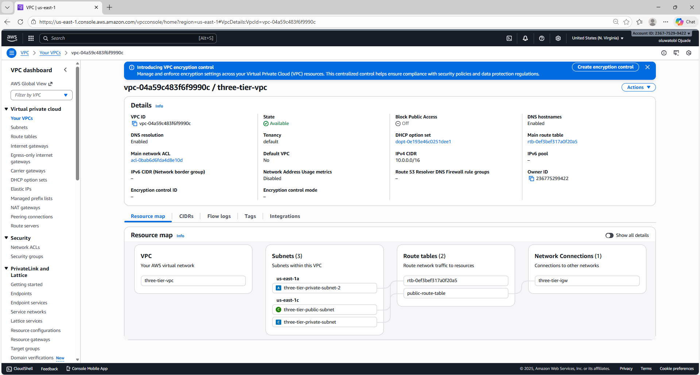
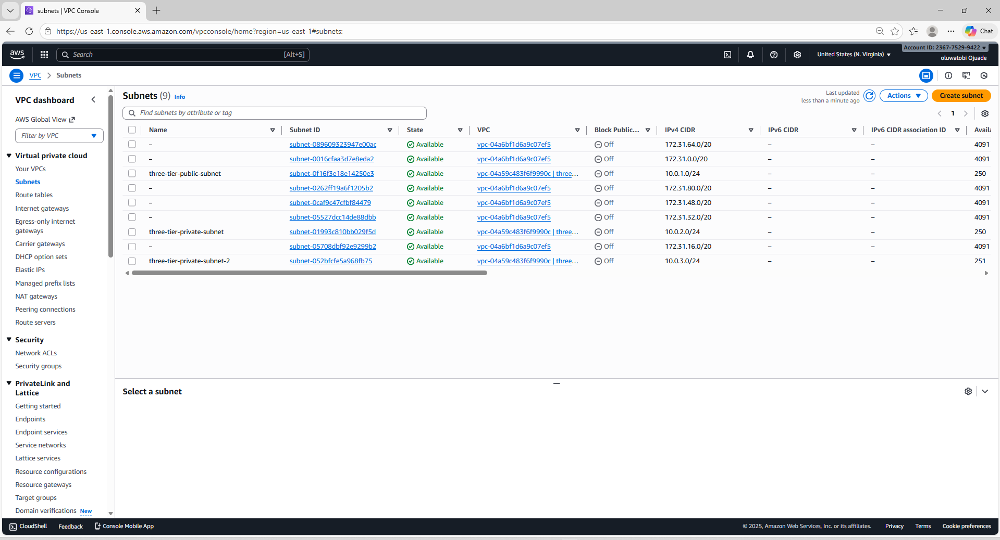
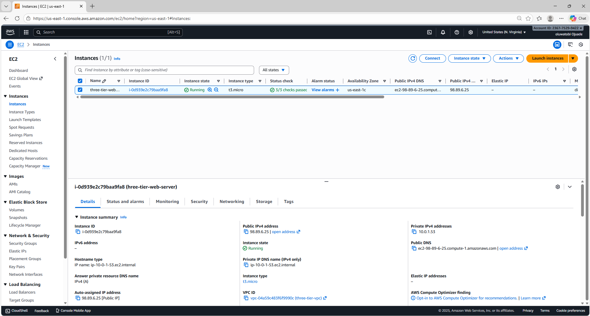
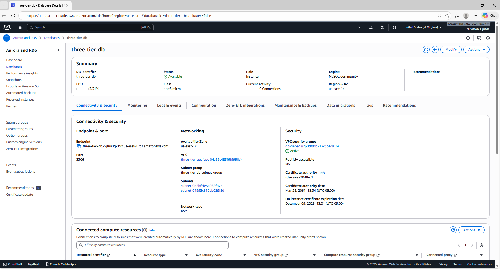
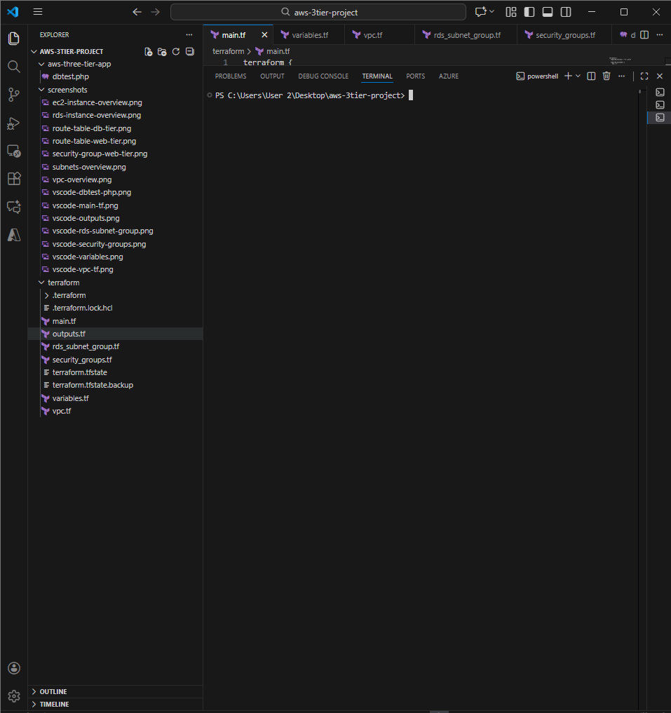
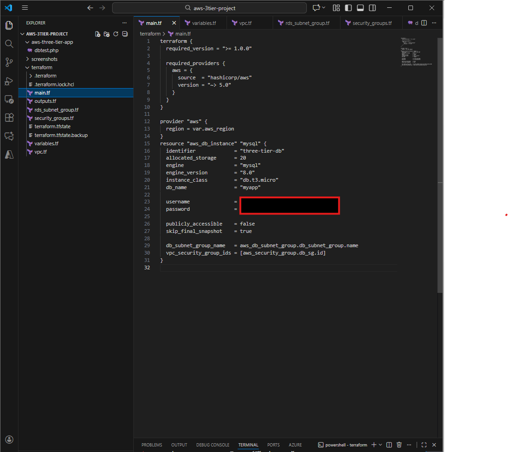
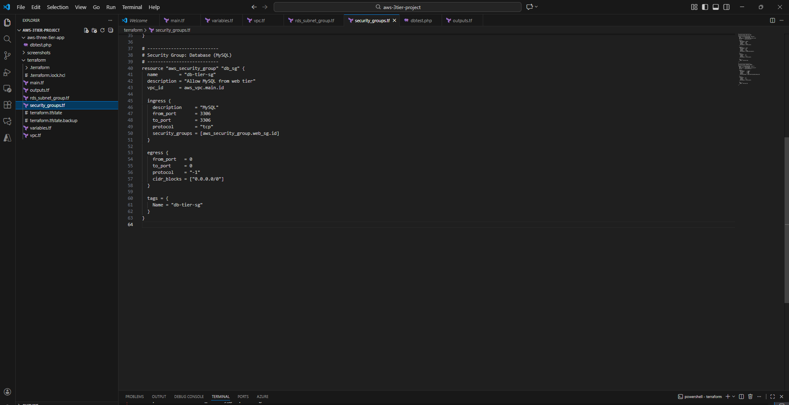
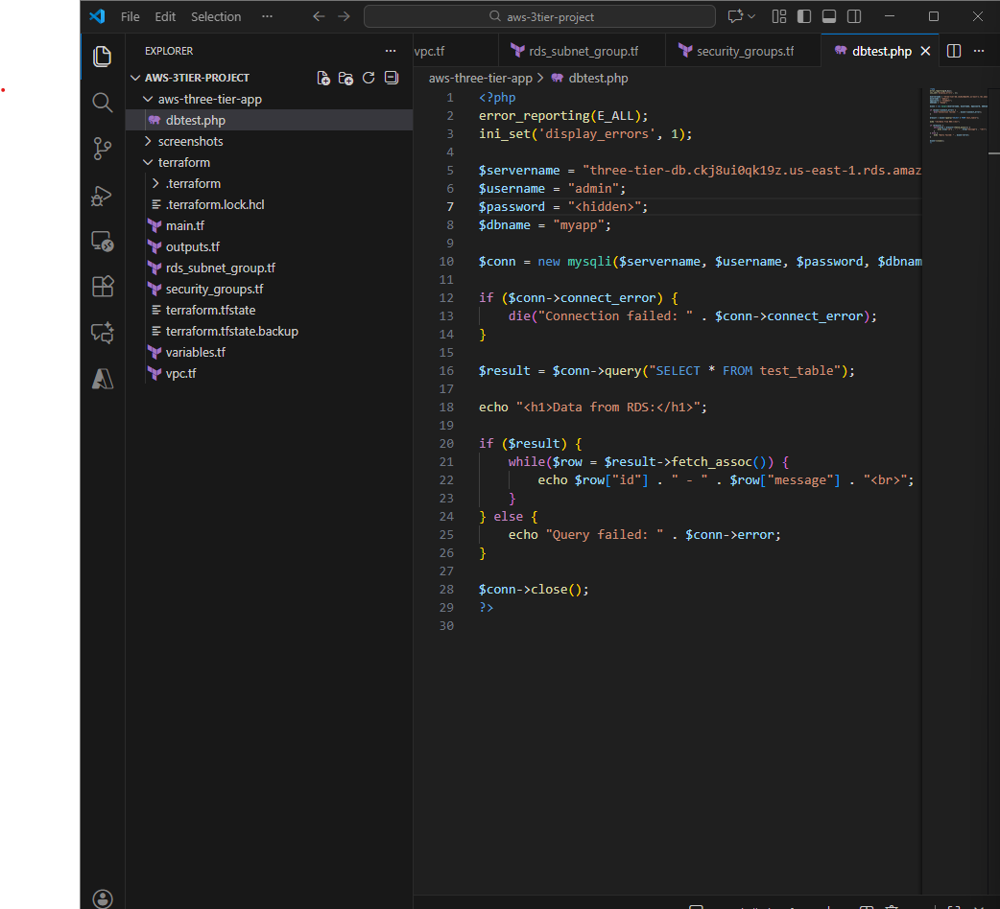
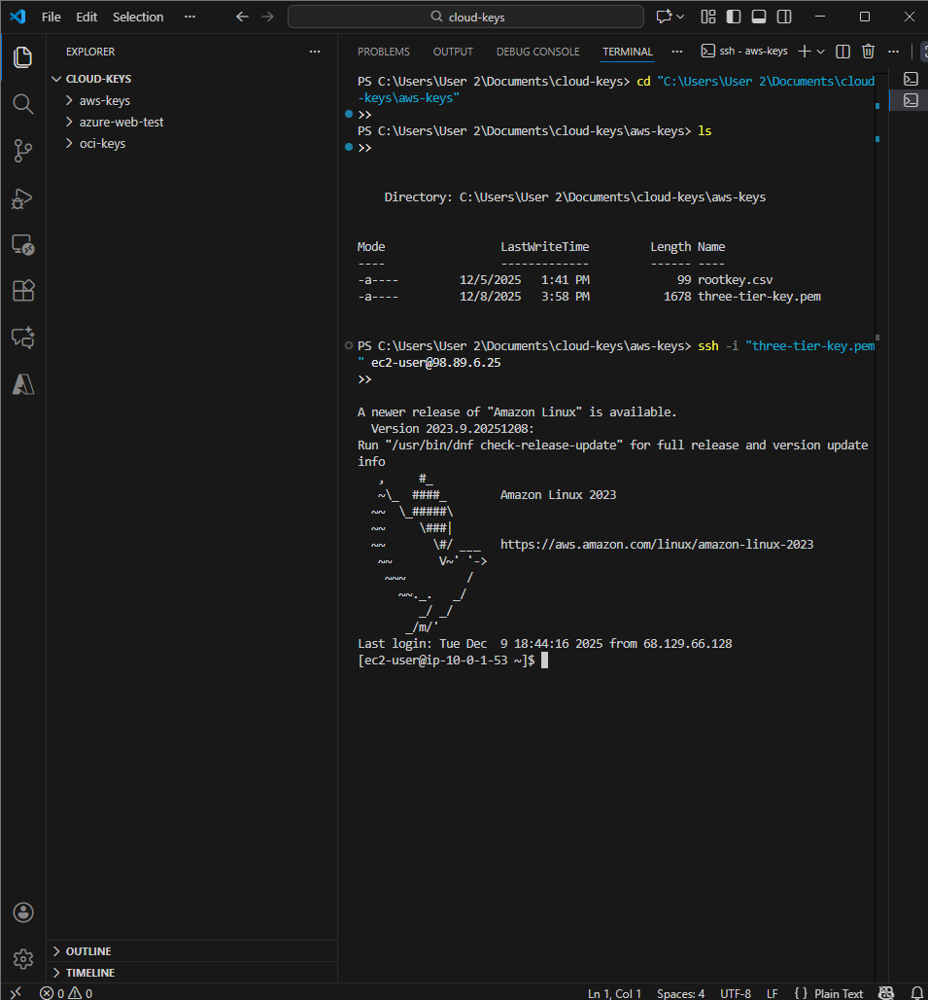

# 🏗️ AWS Three-Tier Web Application

A fully deployed **AWS 3-Tier Web Application** built with Terraform, EC2, RDS MySQL, and PHP.

[](https://www.terraform.io/)
[](https://aws.amazon.com/)
[](https://www.php.net/)

---

## 📋 Table of Contents

- [Architecture Overview](#-architecture-overview)
- [Technologies Used](#-technologies-used)
- [Project Structure](#-project-structure)
- [Deployment Steps](#-deployment-steps)
- [Screenshots](#-screenshots)
- [Purpose](#-purpose)
- [Author](#-author)

---

## 🏛️ Architecture Overview

A production-style 3-tier architecture:

```
┌─────────┐     ┌──────────────┐     ┌──────────────┐
│  User   │────▶│  EC2 Web/App │────▶│  RDS MySQL   │
└─────────┘     │  (Apache+PHP)│     │  (Database)  │
                └──────────────┘     └──────────────┘
                        │                     │
                    ┌───┴─────────────────────┴───┐
                    │    VPC + Security Groups    │
                    └─────────────────────────────┘
```

### Key Components:

- **Presentation Tier**: User-facing web interface
- **Application Tier**: EC2 instance running Apache + PHP
- **Data Tier**: RDS MySQL database in private subnet
- **Networking**: VPC with public/private subnets, routing, and security groups

---

## 🛠️ Technologies Used

| Category | Technology |
|----------|-----------|
| **Cloud Provider** | AWS (EC2, RDS, VPC) |
| **Infrastructure as Code** | Terraform |
| **Web Server** | Apache HTTP Server |
| **Backend** | PHP 8.x |
| **Database** | MySQL (RDS) |
| **Operating System** | Amazon Linux 2023 |

---

## 📂 Project Structure

```
aws-three-tier-webapp/
│
├── aws-three-tier-app/
│   └── dbtest.php              # PHP app for testing RDS connectivity
│
├── terraform/
│   ├── main.tf                 # Main Terraform configuration
│   ├── variables.tf            # Input variables
│   ├── outputs.tf              # Output values
│   ├── vpc.tf                  # VPC configuration
│   ├── security_groups.tf      # Security group rules
│   └── rds_subnet_group.tf     # RDS subnet configuration
│
└── screenshots/                # Documentation screenshots
    ├── vpc-overview.png
    ├── ec2-instance-overview.png
    ├── rds-instance-overview.png
    └── ...
```

---

## 🚀 Deployment Steps

### Prerequisites

- AWS Account with appropriate permissions
- Terraform installed (`v1.0+`)
- AWS CLI configured
- SSH key pair for EC2 access

### Step 1: Deploy Infrastructure with Terraform

```bash
cd terraform/

# Initialize Terraform
terraform init

# Review the execution plan
terraform plan

# Apply the configuration
terraform apply
```

### Step 2: Configure EC2 Instance

SSH into your EC2 instance:

```bash
ssh -i your-key.pem ec2-user@<EC2-Public-IP>
```

Install Apache and PHP:

```bash
sudo dnf update -y
sudo dnf install -y httpd php php-mysqlnd
sudo systemctl start httpd
sudo systemctl enable httpd
```

### Step 3: Deploy Application

Upload your PHP application:

```bash
sudo cp dbtest.php /var/www/html/
sudo chown apache:apache /var/www/html/dbtest.php
```

### Step 4: Test the Application

Visit your application:

```
http://<EC2-Public-IP>/dbtest.php
```

Expected output:

```
Data from RDS:
1 - Hello from AWS RDS!
```

---

## 📸 Screenshots

### Infrastructure Components

#### VPC Architecture


#### Subnet Configuration


#### EC2 Instance


#### RDS Database


### Terraform Configuration

#### Project Structure in VS Code


#### Main Terraform Configuration


#### Security Groups Configuration


### Application Layer

#### PHP Database Test File


#### SSH into EC2


---

## 🎯 Purpose

This project demonstrates real-world cloud engineering skills:

✅ **Infrastructure as Code** - Automated AWS infrastructure with Terraform  
✅ **Secure Networking** - VPC design with public/private subnets  
✅ **Linux Administration** - EC2 configuration and web server setup  
✅ **Full-Stack Integration** - PHP application connecting to RDS  
✅ **Cloud Architecture** - Production-ready 3-tier design  

### Use Cases:

- 📚 Learning AWS architecture patterns
- 💼 DevOps/Cloud Engineer portfolio projects
- 🎤 Technical interview demonstrations
- 🏢 Reference for production deployments

---

## 🔒 Security Considerations

- EC2 instance in public subnet (web tier only)
- RDS in private subnet (no direct internet access)
- Security groups restrict traffic by port and source
- Database credentials managed securely (not hardcoded)

---

## 🚧 Future Enhancements

- [ ] Add Application Load Balancer for high availability
- [ ] Implement Auto Scaling Groups
- [ ] Add CloudWatch monitoring and alarms
- [ ] Set up automated backups with AWS Backup
- [ ] Implement CI/CD pipeline with GitHub Actions
- [ ] Add SSL/TLS certificates with ACM

---

## 🙌 Author

**Oluwatobi Ojuade**  
☁️ Cloud Engineer • DevOps • Multi-Cloud Builder

[](www.linkedin.com/in/oluwatobi-ojuade-9709ab343)
[](https://ojuaos23.github.io/)

---

## 📝 License

This project is open source and available under the [MIT License](LICENSE).

---

## 🤝 Contributing

Contributions, issues, and feature requests are welcome! Feel free to check the [issues page](../../issues).

---

<div align="center">

**⭐ Star this repo if you found it helpful!**

Made with ❤️ and ☕

</div>
